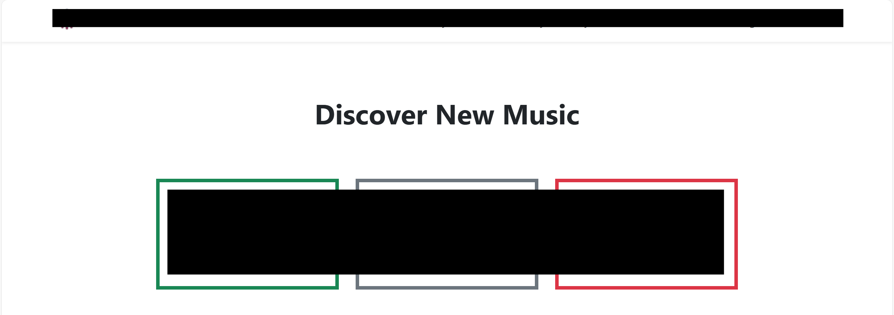

## Bootstrap as a UI Framework
Bootstrap is a popular web design front-end framework that allows users to design websites with a clean modern look that I recently had the (dis)honor of learning. As a framework, Bootstrap provides many prebuilt CSS classes that are easy to implement. Instead of having to create a style.css, creating different div classes, and styling each class individually, the Bootstrap framework already has different classes and multiple configurations that make this process a lot easier to read and manage. In addition, Bootstrap makes it easier to create adaptive web apps with content that changes according to the size of the screen, maintaining a clean modern look even on different devices. Bootstrap also contains many icons that are easy to implement, saving the trouble of having to search online for a decent quality stock image. 

## First Experience With Bootstrap
Although I was familiar with HTML and CSS, this was my first time dealing with a front-end framework so I found it quite difficult to get the hang of it. Because all the classes are prebuilt, learning all of the different classes and sub-components made it longer to build a site at first. To me, Bootstrap is to CSS in a similar way that Python is to C. With pure CSS, I had full control of all my classes and could style each of them individually. With Bootstrap, many things are abstracted away from the developer but I no longer have to create a hundred different div classes just to design the same look as a few Bootstrap classes. There was a rough learning curve as I would not say I am fluent in CSS, which means I was even less fluent in Bootstrap. The classic problem of "how do I center a div" was a nightmare to deal with. Since many classes such as "container" have default margins and padding, it was sometimes frustrating trying to rearrange the divs to either keep them in a singular line or separate them into different sections. Some of the options in Bootstrap are also more limiting than I thought. For example, the largest font size "fs-1" is not quite as big as I would imagine it to be for something that is the "largest." There is also no way to get a larger font without modifying the Sass map (what even is that?). Despite some of the troubles I encountered, it was pretty cool seeing my amatuer usage of Bootstrap turn into a semi-decent looking page.  

The biggest font size is quite small, even when bolded

## Overall Opinion
While I am personally not a huge fan of Bootstrap just yet, I recognize that it is an incredible tool that can help software engineers design adaptive web apps that look good and are easy to modify. There is a reason Bootstrap is one of the most popular front-end frameworks. An experienced developer could utilize Bootstrap to cook up clean looking sites with relative ease. Because of the extensive documentation Bootstrap supplies, it also makes it easier for future modifications as developers don't need to go edit a whole file of user-defined CSS classes. 
