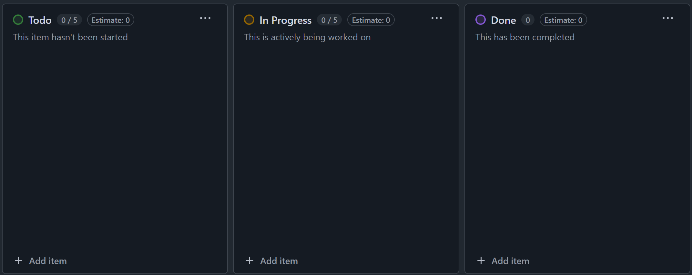

## Retrospective
Throughout my time in this software engineering course, I have learned how to apply new skills and tools to create functional sites. I started this class with little to no knowledge of JavaScript and ended with a complete project using a variety of different tools. Though I am just an infant in the world of software engineering, I have already gained a lot of useful experience for my future. 

## Improving Software Engineering Skills
One of the most important tools I learned how to use is NextJS, a React framework that allows developers to easily create clean user interfaces with the use of components. Using a user interface framework enables me to use premade buttons, navbars, and other components while also being able to freely style them. Without these frameworks, manually building sites from scratch would become tedious and be more prone to bugs. Designing a user-friendly interface was something I had never really made before so it was challenging to use a new tool while ensuring that the site was easy to use. 

A skill that this class has taught me is Issue Driven Project Management, a way of management which entails breaking up larger problems into smaller chunks and separating them based on whether it is completed, currently in progress, or not yet started. This might seem like an "obvious" way to manage a huge project but it is still a highly useful management system, especially when working in a group. For the final project for this class, we utilized GitHub Issues to sort items into different categories based off completion. For example, we might add "Create home page" as an issue to do, which would then later get moved to an issue in progress when assigned to someone. This helped us easily keep track of tasks needed to get done and holds people accountable for fulfilling their assigned task. 

           

## Application Beyond Web Development
Besides learning how to create and manage a website, I think these software engineering skills can be applied in other areas as well. Designing a user interface requires putting yourself in the position of the client and imagining viewing your site for the first time. As a developer, it will seem obvious what each button does and how to navigate to different pages, but a user could be overwhelmed. Large amounts of text can give the user important information at the cost of clogging up screen, while too little text can achieve a cleaner look while leaving the user confused as to what buttons do. When creating something that has users, it is crucial to develop in such a way that is unambiguous to the client. Issue Driven Project Management can also be applied outside of software engineering since it is more of task management system useful for any project. Splitting up larger tasks can make them less daunting, more realistic, and therefore more achievable. In group settings especially, knowing who is responsible for completing which task prevents people from accidentally working over each other on the same task and holds them accountable for completing their assigned task.
