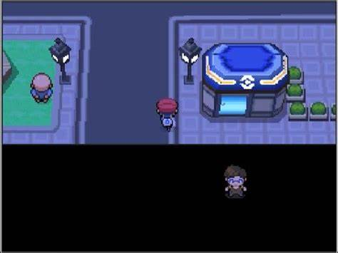

## Curiosity Piqued

I grew up addicted to video games. It started with a GameBoy Advanced, then a DSi, then a 3DS, then 2 different iPads, then a laptop, and finally a Nintendo Switch. Although I rarely have enough time for games nowadays, I still consider them as the source of my love for software and the reason I decided to major in Computer Science. I still have fond memories of watching videos on the different types of glitches in the Pokemon games. It was how I learned about the infamous MissingNO, how doing specific movements can activate the Void Glitch which allowed the player to bypass large chunks of terrain, or that dealing too much damage at once can result in weird behavior due to integer overflow. It was so interesting to learn how buggy programs could be and made me more curious as to how it functioned as a whole. How does it know to move the character when I press certain buttons? How does it know to not move my character when I press those same buttons while on a menu screen? How can the program save the game and allow me to maintain my progress even after I turn off the device?

## Shaky Start
After learning that Minecraft was coded in Java, I decided to try teach myself using online resources. It did not go so well at first because I had ZERO clue what I was doing. I kept confusing Java with JavaScript and all the online material went straight past my head. I felt so lost that I had given up for a while but my curiosity would not let me give up. I began learning Python through an app called Sololearn, which is quite similar to Duolingo with a daily streak incentive that made it easier for me to learn every day. Soon after, I began taking AP Computer Science Principles where I got a more formal understanding of various computer science topics. Despite having a rough start with programming, I love the way it challenges me in problem solving and abstract thinking. APCSP gave me the freedom to create relatively complex projects that I found fun. 

## Now What?
Despite enjoying the challenges and various topics in computer science, I did not really know what to do with all my knowledge. I was learning for the sake of learning and did not have a specific goal in mind, which I do not think is inherently a bad thing, but I often found it hard to answer any questions about my future career. With my love of video games, I did consider game developement but I have heard about the toxic work culture and also did not want to tarnish my love for video games by turning it into a career. My experience with Python has also led me to consider data analysis and AI/machine learning. While I do think both fields are quite interesting, I personally do not find it as fun as other fields. Although I am not entirely committed to a specific field, I am leaning towards software development. I love probleming solving and it would be cool to create applications that can have real-world benefits. 

## Moving Forward
There is still so much for me to learn about software engineering and computer science in general. I definitely want to dip my toes in as many different fields as possible to learn more about different paths I can take and to just have a better understanding of the technological world. A skill I think I definitely want to improve upon and develop is organization. I hope to implement a clear, concise, and maintainable coding standard in my programs to become a better developer. Git and GitHub is something I also want to develop proficiency in as it will make it easier to both maintain my own code through version history and collaborate with other developers on bigger projects. In order to help me learn these skills, I plan on participating in HACC where I can focus on following proper coding standards while developing an application. I hope that I can learn even more and I am excited to continue my software journey. 
