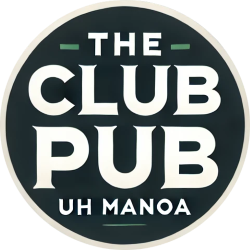
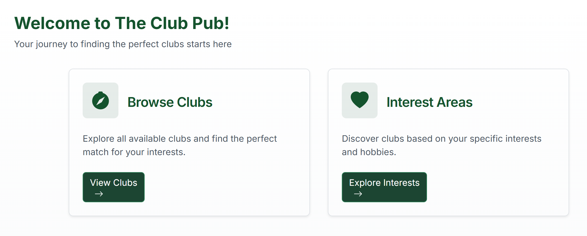

 

## About
The Club Pub is a project developed by our group, 404jobsnotfound, for our final project in ICS314. Our site is a centralized hub that allows students to easily discover clubs at UH Manoa. Regular site users are able to browse from a list of available clubs and view details such as meeting times, location, and contact information. Club admins are able to add new clubs and edit any clubs they create. They can also assign other people as admins for their club. Site admins are able to do all of the above and are also able to delete any club. The site was created using the NextJS framework, PostgreSQL for database management, Vercel for site deployment, and GitHub for project management. Along with our site, we also created a homepage that provides more details about our group, our development process, and guides for users and developers on accessing our site. 
 

        

## My Role
Most of my contributions to the project were on adding to our group's homepage. I kept the homepage updated with all the necessary submission requirements while also ensuring that it was presentable to users outside the class. My contributions to the actual site were less on the coding side and more on the designing. I helped out in outlining the functionality of the site such as defining the specific permissions of each user type. My code contributions were mostly bugfixing and polishing up the site. 

## What I Learned
This was my first experience developing a project working with other group members. In order to effectively delagate tasks and maintain productivity, we applied a style of Agile Project Management called Issue Driven Project Management using GitHub Issues. It took some time to get used to but it became a valuable resource in listing out required tasks and assigning people to completing certain tasks, which ensured that we did not accidentally work on the same task separately and kept us accountable for providing completion of our assigned tasks. Because we used GitHub, I learned more about using Git version control system tools such as branches, pulling, and merging, and how to effectively apply them in managing a project. I also realized the importance of branch and commit naming since we were not as strict and standardized as we probably should have been which made it slightly unorganized at times. 

This was also my first time using all of these interacting technologies to develop a fully functional site. I had never previously worked with databases before so it was a useful experience learning how to incorporate a PostgreSQL database using Prisma. I also did not have much experience with frontend development but learning NextJS and creating a public site helped me become more concious of the user experience in terms of layout, responsiveness, and ease of use. 

---

Link to homepage:
[https://404jobsnotfound.github.io/](https://404jobsnotfound.github.io/)

Direct link to deployed site
[here](https://the-club-pub-git-test1-patricks-projects-491ced00.vercel.app/?_vercel_share=kx7zbHtZDkfMgfq28ZHsXK136z98NvUM)

Link to source code:
[https://github.com/404jobsnotfound/the-club-pub](https://github.com/404jobsnotfound/the-club-pub)
